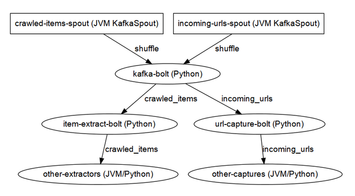

==============
Python ♥ Storm
==============

A Pythonista navigating Stormy waters.

Andrew Montalenti, CTO

.. rst-class:: logo

    .. image:: ./_static/parsely.png
        :width: 40%
        :align: right

Agenda
======

* Parse.ly problem space
* Why Storm for Python?
* Multi-Lang Protocol
* Why ``streamparse``?
* Logs and Kafka

Admin
=====

Our presentations and code:

http://parse.ly/code

This presentation's slides:

http://parse.ly/slides/streamparse

This presentation's notes:

http://parse.ly/slides/streamparse/notes

=================
What is Parse.ly?
=================

What is Parse.ly?
=================

.. image:: ./_static/parsely_customers.png
    :width: 85%
    :align: center

Web content analytics for digital storytellers.

.. note::

    Gives web content teams a clear understanding about
    **what readers want** and how to deliver it to them
    in the most effective way.

    Answers questions for journalists and editors, like:

    * What stories are **most popular in the last 4 hours**?
    * Which **authors drive the most Facebook traffic**?
    * What is the relationship between **sharing and reading**?

    For product teams, our API enables **dynamic content
    recommendations** which can be implemented in minutes.

Velocity
========

Average post has **<48-hour shelf life**.

.. image:: ./_static/pulse.png
    :width: 60%
    :align: center

.. note::

    * many posts get **most traffic in first few hours**
    * major news events can cause **bursty traffic**

Volume
======

Top publishers write **1000's of posts per day**.

.. image:: ./_static/sparklines_multiple.png
    :align: center

.. note::

    * huge **long tail of posts** get traffic forever
    * Parse.ly tracks **8 billion page views per month**
    * ... from **over 250 million monthly unique browsers**

Time series data
================

.. image:: ./_static/sparklines_stacked.png
    :align: center

Summary data
============

.. image:: ./_static/summary_viz.png
    :align: center

Ranked data
===========

.. image:: ./_static/comparative.png
    :align: center

Benchmark data
==============

.. image:: ./_static/benchmarked_viz.png
    :align: center

Information radiators
=====================

.. image:: ./_static/glimpse.png
    :width: 100%
    :align: center

======================
Architecture evolution
======================

Parse.ly Architecture, 2012
===========================

.. image:: /_static/tech_stack.png
    :width: 90%
    :align: center

.. note::

    To add more features, we had to add more workers and queues!

    Got harder and harder to develop on "the entire stack".

    More code devoted to ops, rather than business logic.

It started to get messy
=======================

.. image:: ./_static/monitors.jpg
    :width: 90%
    :align: center

Parse.ly Data Sources
=====================

.. image:: ./_static/parsely_data_sources.png
    :width: 70%
    :align: center

Parse.ly Architecture, 2014
===========================

.. image:: ./_static/parsely_log_arch.png
    :width: 90%
    :align: center

=================
Discovering Storm
=================

What is this Storm thing?
=========================

We read:

"Storm is a **distributed real-time computation system**."

"Great," we thought. "But, what about Python support?"

Hmm...

Storm is "Javanonic"
====================

Ironic term one of my engineers came up with for a project that feels very
Java-like, and not very "Pythonic".

Examples:

- Topologies specified using a Java builder interface (eek).
- Topologies built from CLI using Maven tasks (yuck).
- Topology submission needs a JAR of your code (ugh).
- No simple interactive or local dev workflow built-in (boo).
- Talking to the Storm cluster uses Thrift interfaces (shrug).

Storm as Infrastructure
=======================

Do we consider Cassandra, Zookeeper, or Elasticsearch to be "projects for Java
developers", or "system infrastructure that happens to be implemented in
Java?"

I'd argue for these projects, it's the latter.

One would hope that Storm could attain this same status.

That is, a **cross-language real-time computation infrastructure**, rather than
a **Java real-time computation framework with some multi language support.**

Where Python is a **first-class citizen**.

Python GIL
==========

Python's GIL does not allow true multi-thread parallelism:

.. image:: _static/python_gil_new.png
    :align: center
    :width: 80%

And on multi-core, it even leads to lock contention:

.. image:: _static/python_gil.png
    :align: center
    :width: 80%

Python Processes
================

For a Python programmer, Storm provides a way to get **process-level
parallelism** while avoiding the perils of multi-threading.

Sweet!

This is like Celery, RQ, multiprocessing, joblib, but with the added benefit of
**data flows** and **reliability**.

We'll take it!

Multi-Lang Protocol (1)
=======================

Storm supports multiple languages through the **multi-lang protocol**.

JSON protocol that works via shell-based components that communicate over
``STDIN`` and ``STDOUT``.

Kinda quirky, but also relatively simple to implement.

Multi-Lang Protocol (2)
=======================

Each component of a Storm topology is either a ``ShellSpout`` or ``ShellBolt``.

Storm worker invokes **one sub-process per shell component per Storm task**.

If ``p = 8``, then 8 Python processes are spawned under a worker.

Multi-Lang Protocol (3)
=======================

Storm Tuples are serialized by Storm worker process into JSON, sent over
``STDIN`` to components.

Storm worker process also parses JSON output sent over ``STDOUT`` and then
sends it to appropriate downstream tasks via Netty/ZeroMQ mechanism.

All non-Trident mechanics supported: tuple tree, ack/fail.

Packaging for Multi-Lang
========================

Java topologies are simply added to the classpath and appropriate Storm
classes are instantiated.

Multi-Lang uses the ``/resources`` path in the JAR.

Storm will explode ``/resources`` into a scratch area and code will be run out
of there.

When using the bundled module, you **copy-paste** ``storm.py`` adapter in
your ``/resources`` directory and ``import storm`` to speak the protocol.

Very Javanonic.

Biggest storm.py issues
=======================

- No unit tests
- No documentation
- No local dev workflow
- ``print`` statement breaks topology
- Cannot ``pip install``
- Packaging is a nightmare

Petrel, the Good
================

- First serious effort to make Storm Pythonic.
- Open source by AirSage around ~2012.
- Rewrites ``storm.py`` IPC layer.
- Bundles a JAR builder.
- Implements a Python Topology DSL of sorts.
- Uses Thrift for Topology construction.

We used Petrel from 2012-2014.

Petrel, the Bad
===============

- No commits in last 10 months.
- Maintainer no longer using Storm.
- Doesn't allow standard Python import paths.
- Deploys take a long time.
- Dependency management is strangely done.
- Requires local Thrift installation to work.
- Still doesn't solve local dev workflow.

"What if we had a Pythonic Storm lib?"
======================================

- Idea was brewing on Parse.ly team in Jan 2014.
- Backend team had just grown up, new engineers.
- New engineers had trouble with Storm.
- I discovered ``storm-test`` and ``Clojure DSL``.
- Colleague started a clean-house IPC layer.

Enter streamparse
=================

0.1 release at PyData Silicon Valley 2014 in Apr 2014.

Talk, `"Real-Time Streams and Logs"`_, introduced it.

550+ stars `on Github`_, was a trending repo in May 2014.

70+ mailing list members and 4 new committers.

Major corporate and academic entities using it.

Funding `from DARPA`_ to continue developing it. (Yes, really!)

.. _"Real-Time Streams and Logs": https://www.youtube.com/watch?v=od8U-XijzlQ
.. _on Github: https://github.com/Parsely/streamparse
.. _from DARPA: http://www.fastcompany.com/3040363/the-future-of-search-brought-to-you-by-the-pentagon

streamparse CLI
===============

``sparse`` provides a CLI front-end to ``streamparse``, a framework for
creating Python projects for running, debugging, and submitting Storm
topologies for data processing.

After installing the ``lein`` (only dependency), you can run::

    pip install streamparse

This will offer a command-line tool, ``sparse``. Use::

    sparse quickstart

Running and debugging
=====================

You can then run the local Storm topology using::

    $ sparse run
    Running wordcount topology...
    Options: {:spec "topologies/wordcount.clj", ...}
    #<StormTopology StormTopology(spouts:{word-spout=...
    storm.daemon.nimbus - Starting Nimbus with conf {...
    storm.daemon.supervisor - Starting supervisor with id 4960ac74...
    storm.daemon.nimbus - Received topology submission with conf {...
    ... lots of output as topology runs...

streamparse vs storm.py
=======================

.. image:: _static/streamparse_comp.png
    :align: center
    :width: 80%

Word Stream Spout (Storm)
=========================

.. sourcecode:: clojure

    {"word-spout" (python-spout-spec
          options
          "spouts.words.WordSpout"
          ["word"]
          )
    }

Word Stream Spout in Python
===========================

.. sourcecode:: python

    import itertools

    from streamparse.spout import Spout

    class WordSpout(Spout):

        def initialize(self, conf, ctx):
            self.words = itertools.cycle(['dog', 'cat',
                                          'zebra', 'elephant'])

        def next_tuple(self):
            word = next(self.words)
            self.emit([word])

Word Count Bolt (Storm)
=======================

.. sourcecode:: clojure

    {"count-bolt" (python-bolt-spec
            options
            {"word-spout" :shuffle}
            "bolts.wordcount.WordCount"
             ["word" "count"]
             :p 2
           )
    }

Word Count Bolt in Python
=========================

.. sourcecode:: python

    from collections import Counter

    from streamparse.bolt import Bolt

    class WordCounter(Bolt):

        def initialize(self, conf, ctx):
            self.counts = Counter()

        def process(self, tup):
            word = tup.values[0]
            self.counts[word] += 1
            self.emit([word, self.counts[word]])
            self.log('%s: %d' % (word, self.counts[word]))

config.json
===========

.. sourcecode:: javascript

    {
        "topology_specs": "topologies/",
        "envs": {
            "0.8": {
                "user": "cogtree",
                "nimbus": "ue1a-storm-head.cogtree.com:6627",
                "workers": ["ue1a-storm1.cogtree.com",
                            "ue1a-storm2.cogtree.com"],
                "log_path": "/var/log/cogtree/storm",
                "virtualenv_root": "/data/virtualenvs"
            },
            "vagrant": {
                "user": "cogtree",
                "nimbus": "vagrant:6627",
                "workers": ["vagrant"],
                "log_path": "/home/cogtree/storm/logs",
                "virtualenv_root": "/home/cogtree/virtualenvs"
            }
        }
    }

streamparse projects
====================

.. image:: ./_static/streamparse_project.png
    :width: 90%
    :align: center

But wait, there's more!
=======================

Got it into production in the summer of 2014.

The effort just snowballed from there.

Added a lot more functionality to the CLI tools.

IPC layer saw Pythonic improvements.

Better support for logging.

A solid ``BatchingBolt`` implementation.

Several ``auto_`` class options.

sparse options
==============

.. sourcecode:: text

    $ sparse help

    Usage:
            sparse quickstart <project_name>
            sparse run [-o <option>]... [-p <par>] [-t <time>] [-dv]
            sparse submit [-o <option>]... [-p <par>] [-e <env>] [-dvf]
            sparse list [-e <env>] [-v]
            sparse kill [-e <env>] [-v]
            sparse tail [-e <env>] [--pattern <regex>]
            sparse visualize [--flip]
            sparse (-h | --help)
            sparse --version

sparse visualize
================

BatchingBolt
============

.. sourcecode:: python

    from streamparse.bolt import BatchingBolt

    class WordCounterBolt(BatchingBolt):

        secs_between_batches = 5

        def group_key(self, tup):
            # collect batches of words
            word = tup.values[0]
            return word

        def process_batch(self, key, tups):
            # emit the count of words we had per 5s batch
            self.emit([key, len(tups)])

Use cases for BatchingBolt
==========================

We use for writing to data stores:

- Cassandra
- Elasticsearch
- Redis
- MongoDB

Background thread handles tuple grouping and timer thread for flushing batches.

Adds **reliable micro-batching** to Storm.

``auto_`` properties
====================

============= ========================================
property      What it does
============= ========================================
auto_ack      ack tuple after ``process``
auto_fail     fail tuple when exception in ``process``
auto_anchor   anchor tuple via incoming tuple ID
============= ========================================

.. sourcecode:: python

    class WordCounter(Bolt):

        auto_fail = False
        auto_ack = False
        auto_anchor = False

        def process(self, tup):
            word = tup.values[0]
            self.emit([word])

======================
A New Parse.ly Backend
======================

Reference Architecture
======================

.. image:: ./_static/parsely_ref_arch.png
    :width: 90%
    :align: center

Complete F/OSS Stack
====================

.. image:: ./_static/parsely_oss.png
    :width: 90%
    :align: center

A vision for new metrics
========================

.. image:: _static/parsely_icons.png
    :width: 50%
    :align: center

======================
Organizing around logs
======================

Kafka and Multi-consumer
========================

Even if Kafka's availability and scalability story isn't interesting to you,
the **multi-consumer story should be**.

.. image:: ./_static/multiconsumer.png
    :width: 60%
    :align: center

Kafka + Storm
=============

Good fit for at-least-once processing.

No need for out-of-order acks.

Community work is ongoing for at-most-once processing.

Able to keep up with Storm's high-throughput processing.

Great for handling backpressure during traffic spikes.

Kafka in Python (1)
===================

``kafka-python``. Ugh, yet more problems!

No consumer groups for Python in 0.8!!!!

https://github.com/mumrah/kafka-python

.. sourcecode:: python

    from kafka.client import KafkaClient
    from kafka.consumer import SimpleConsumer

    kafka = KafkaClient('localhost:9092')
    consumer = SimpleConsumer(kafka, 'test_consumer', 'raw_data')
    for msg in consumer:
        pass

Kafka in Python (2)
===================

Resurrecting our own project, ``samsa``.

0.7 support working, 0.8 support on branch. Will rename project soon to avoid
confusion with ``samza``.

https://github.com/getsamsa/samsa

.. sourcecode:: python

    from samsa.cluster import Cluster
    from kazoo.client import KazooClient

    zk = KazooClient(); zk.start(); cluster = Cluster(zk)
    queue = cluster.topics['raw_data'].subscribe('test_consumer')
    count = 0
    for msg in queue:
        count += 1
        if count % 1000 == 0: queue.commit_offsets()

Kafka JVM Spout in streamparse?
===============================

Wrote an example project that uses built-in ``storm-kafka`` spout with
streamparse by instantiated a JVM Spout via Clojure code.

It works, but it's a bit painful to set up.

.. sourcecode:: clojure

    (def spout-config
        (let [cfg (SpoutConfig. kafka-zk-hosts
                                topic-name
                                kafka-zk-root
                                kafka-consumer-id)]
            (set! (. cfg scheme)
                  (SchemeAsMultiScheme. (StringScheme.)))
            (set! (. cfg forceFromStart) true)
            cfg))

    (def spout (KafkaSpout. spout-config))

Kafka in future ``streamparse`` releases
========================================

Hope to bundle a ``KafkaSpout`` and ``KafkaBolt``, written in Python.

Add a soft dependency to our new, upcoming high-performance Kafka client library.

Would simplify all that setup.

Clearly, Kafka Matters
======================

============= ========= ========
Company       Logs      Workers
============= ========= ========
LinkedIn      Kafka*    Samza
Twitter       Kafka     Storm*
Pinterest     Kafka     Storm
Spotify       Kafka     Storm
Wikipedia     Kafka     Storm
Outbrain      Kafka     Storm
LivePerson    Kafka     Storm
Netflix       Kafka     ???
============= ========= ========

===================
Recent Developments
===================

pyleus
======

In Oct 2014, Yelp released `pyleus`_, an alternative to ``Petrel`` and ``streamparse``.

Apparently used inside Yelp for managing Python Topologies running on Storm.

Largely similar design to ``streamparse``.

One really cool part: **MessagePack Serializer!**

.. _pyleus: http://engineeringblog.yelp.com/2014/10/introducing-pyleus.html

pyleus comparison (1)
=====================

============== =================== =============================
area           pyleus              streamparse
============== =================== =============================
Topo DSL       YAML                Storm Clojure DSL
virtualenv     Embed-in-JAR        Deploy-via-SSH
Storm API      Java Code           Clojure Code
Local Test     ``pyleus local``    ``sparse run``
Submit         ``pyleus submit``   ``sparse submit``
============== =================== =============================

pyleus comparison (2)
=====================

================ =================== ==================
area             pyleus              streamparse
================ =================== ==================
List             ``pyleus list``     ``sparse list``
Configuration    Python conf         JSON conf
Unit Tests       Yes                 Yes
Docs             Yes                 Yes
Uses Thrift?     No                  No
================ =================== ==================

Python Topology DSL?
====================

"What I'm proposing instead is to ditch the idea of specifying topologies via
configuration files and do it instead via an interpreted general purpose
programming language (like Python)."

"By using an interpreted language, you can construct and submit topologies
without having to do a compilation."

Comments recently by Nathan Marz in `STORM-561`_.

.. _STORM-561: https://issues.apache.org/jira/browse/STORM-561

Open Discussion Questions
=========================

- Should ``pyleus`` and ``streamparse`` sync efforts somehow?
- Should we kill ``streamparse`` use of Clojure DSL?
- How important is "true multi-lang"?
- Should we write a Python DSL for ``streamparse``?
- What do we make of Spark, pyspark, Spark Streaming?

DISCUSS!

Questions?
==========

Go forth and stream!

Parse.ly:

* http://parse.ly/code
* http://twitter.com/parsely

Me:

* http://twitter.com/amontalenti

.. raw:: html

    

.. ifnotslides::

    .. raw:: html

        

.. ifslides::

    .. raw:: html

        
