========================
Real-time Streams & Logs
========================

Andrew Montalenti, CTO

Keith Bourgoin, Backend Lead

.. rst-class:: logo

    .. image:: ./_static/parsely.png
        :width: 40%
        :align: right

Agenda
======

* Parse.ly problem space
* Architecture evolution
* Aggregating the stream (Storm)
* Organizing around logs (Kafka)

=================
What is Parse.ly?
=================

What is Parse.ly?
=================

Web content analytics for digital storytellers.

    .. image:: ./_static/banner_01.png
        :align: center
    .. image:: ./_static/banner_02.png
        :align: center
    .. image:: ./_static/banner_03.png
        :align: center
    .. image:: ./_static/banner_04.png
        :align: center

.. note::

    Gives web content teams a clear understanding about
    **what readers want** and how to deliver it to them
    in the most effective way.

    Answers questions for journalists and editors, like:

    * What stories are **most popular in the last 4 hours**?
    * Which **authors drive the most Facebook traffic**?
    * What is the relationship between **sharing and reading**?

    For product teams, our API enables **dynamic content
    recommendations** which can be implemented in minutes.

Velocity
========

Average post has **<48-hour shelf life**.

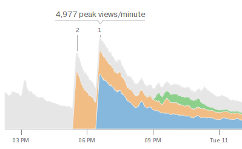

.. note::

    * many posts get **most traffic in first few hours**
    * major news events can cause **bursty traffic**

Volume
======

Top publishers write **1000's of posts per day**.

.. image:: ./_static/sparklines_multiple.png
    :align: center

.. note::

    * huge **long tail of posts** get traffic forever
    * Parse.ly tracks **8 billion page views per month**
    * ... from **over 250 million monthly unique browsers**

Time series data
================

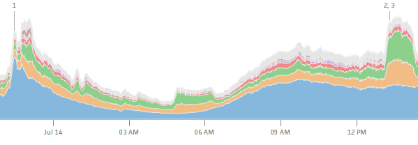

Summary data
============

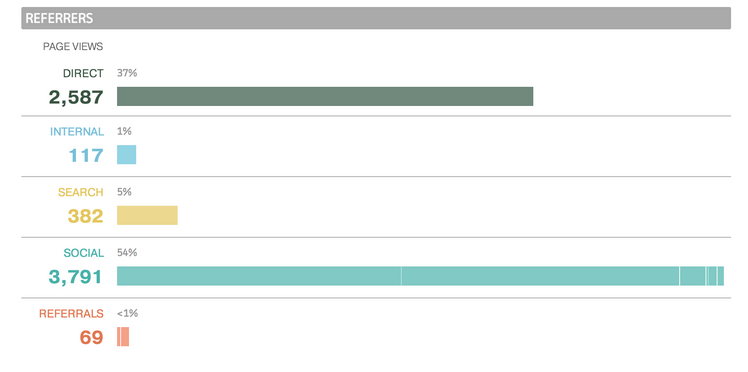

Ranked data
===========

Benchmark data
==============

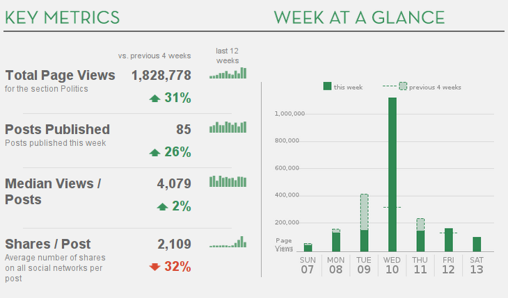

Information radiators
=====================

.. image:: ./_static/glimpse.png
    :width: 100%
    :align: center

======================
Architecture evolution
======================

Stack Overview
==============

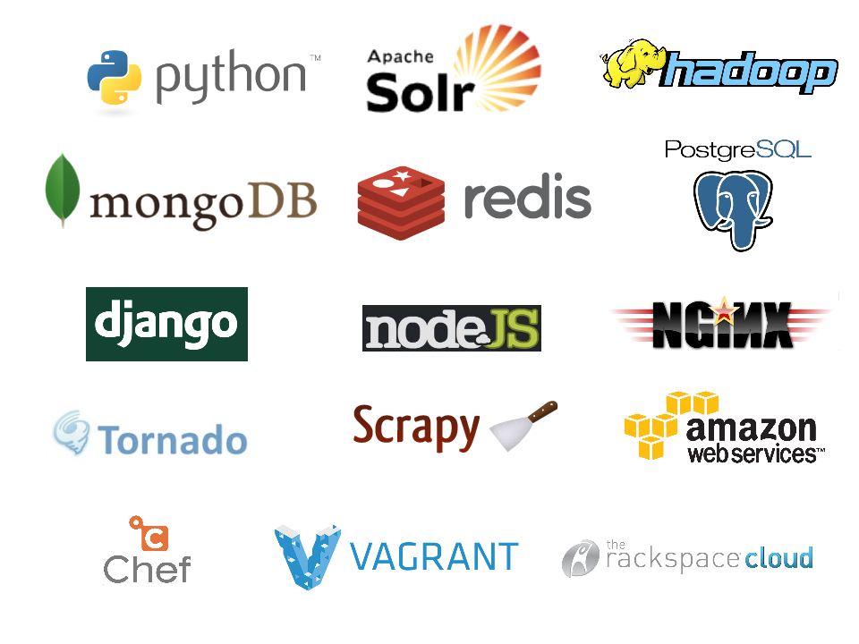

Queues and workers
==================

.. image:: /_static/queues_and_workers.png
    :width: 90%
    :align: center

**Queues**: RabbitMQ => Redis => ZeroMQ

**Workers**: Cron Jobs => Celery

.. note::

    Traditional queues (e.g. RabbitMQ / Redis):

    * not distributed / highly available at core
    * not persistent ("overflows" easily)
    * more consumers mean more queue server load

    (Hint: Kafka solves these problems.)

Workers and databases
=====================

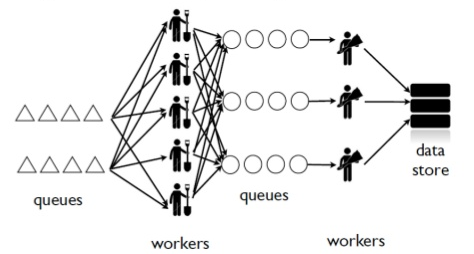

.. note::

    * no control for parallelism and load distribution
    * no guaranteed processing for multi-stage pipelines
    * no fault tolerance for individual stages
    * difficult to do local / beta / staging environments
    * dependencies between worker stages are unclear

Lots of moving parts
====================

.. image:: /_static/tech_stack.png
    :width: 90%
    :align: center

To add more features...
=======================

... we had to add more workers and queues!

Got harder and harder to develop on "the entire stack".

More code devoted to ops, rather than business logic.

In short: it started to get messy
=================================

.. image:: ./_static/monitors.jpg
    :width: 90%
    :align: center

Introducing Storm
=================

Storm is a **distributed real-time computation system**.

Hadoop provides a set of general primitives for doing batch processing.

Storm provides a set of **general primitives** for doing **real-time computation**.

Perfect as a replacement for ad-hoc workers-and-queues systems.

Storm primitives
================

**Streaming** Data Set, typically from **Kafka**.

**ZeroMQ** used for inter-process communication.

**Bolts** & **Spouts**; Storm's **Topology** is a **DAG**.

**Nimbus** & **Workers** manage execution.

**Tuneable parallelism** + built-in **fault tolerance**.

.. note::

    Hadoop Parallel:

    **Durable** Data Set, typically from **S3**.

    **HDFS** used for inter-process communication.

    **Mappers** & **Reducers**; Pig's **JobFlow** is a **DAG**.

    **JobTracker** & **TaskTracker** manage execution.

    **Tuneable parallelism** + built-in **fault tolerance**.

Storm features
==============

* Speed
* Fault tolerance
* Parallelism
* Guaranteed Messages
* Easy Code Management
* Local Dev

Storm core concepts
===================

=============== =======================================================================
Concept         Description
=============== =======================================================================
Stream          Unbounded sequence of data tuples with named fields
Spout           A source of a Stream of tuples; typically reading from Kafka
Bolt            Computation steps that consume Streams and emits new Streams
Grouping        Way of partitioning data fed to a Bolt; for example: by field, shuffle
Topology        Directed Acyclic Graph (DAG) describing Spouts, Bolts, & Groupings
=============== =======================================================================

Wired Topology
==============

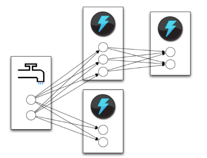

Tuple Tree
==========

Tuple tree, anchoring, and retries.

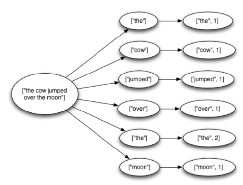

Word Stream Spout (Storm)
=========================

.. sourcecode:: clojure

    ;; spout configuration
    {"word-spout" (shell-spout-spec
          ;; Python Spout implementation:
          ;; - fetches words (e.g. from Kafka)
            ["python" "words.py"]
          ;; - emits (word,) tuples
            ["word"]
          )
    }

Word Stream Spout in Python
===========================

.. sourcecode:: python

    import itertools

    from streamparse import storm

    class WordSpout(storm.Spout):

        def initialize(self, conf, ctx):
            self.words = itertools.cycle(['dog', 'cat',
                                          'zebra', 'elephant'])

        def nextTuple(self):
            word = next(self.words)
            storm.emit([word])

    WordSpout().run()

Word Count Bolt (Storm)
=======================

.. sourcecode:: clojure

    ;; bolt configuration
    {"count-bolt" (shell-bolt-spec
           ;; Bolt input: Spout and field grouping on word
             {"word-spout" ["word"]}
           ;; Python Bolt implementation:
           ;; - maintains a Counter of word
           ;; - increments as new words arrive
             ["python" "wordcount.py"]
           ;; Emits latest word count for most recent word
             ["word" "count"]
           ;; parallelism = 2
             :p 2
           )
    }

Word Count Bolt in Python
=========================

.. sourcecode:: python

    from collections import Counter

    from streamparse import storm

    class WordCounter(storm.Bolt):

        def initialize(self, conf, ctx):
            self.counts = Counter()

        def process(self, tup):
            word = tup.values[0]
            self.counts[word] += 1
            storm.emit([word, self.counts[word]])
            storm.log('%s: %d' % (word, self.counts[word]))

    WordCounter().run()

streamparse
===========

``sparse`` provides a CLI front-end to ``streamparse``, a framework for
creating Python projects for running, debugging, and submitting Storm
topologies for data processing. (*still in development*)

After installing the ``lein`` (only dependency), you can run::

    pip install streamparse

This will offer a command-line tool, ``sparse``. Use::

    sparse quickstart

Running and debugging
=====================

You can then run the local Storm topology using::

    $ sparse run
    Running wordcount topology...
    Options: {:spec "topologies/wordcount.clj", ...}
    #<StormTopology StormTopology(spouts:{word-spout=...
    storm.daemon.nimbus - Starting Nimbus with conf {...
    storm.daemon.supervisor - Starting supervisor with id 4960ac74...
    storm.daemon.nimbus - Received topology submission with conf {...
    ... lots of output as topology runs...

Interested? Lightning talk!

======================
Organizing around logs
======================

Not all logs are applicaton logs
================================

A "log" could be any stream of structured data:

* Web logs
* Raw data waiting to be processed
* Partially processed data
* Database operations (e.g. mongo's oplog)

A series of timestamped facts about a given system

.. note::
    * Not what's going into logstash
    * Redefining "log" and set up what we mean by "log-centric"

LinkedIn's lattice problem
==========================

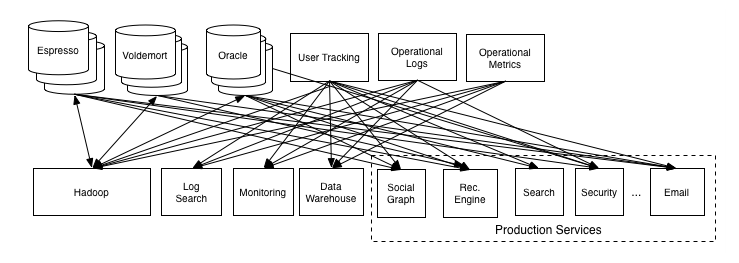

Enter the unified log
=====================

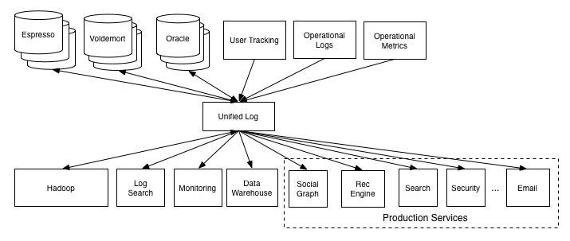

Log-centric is simpler
======================

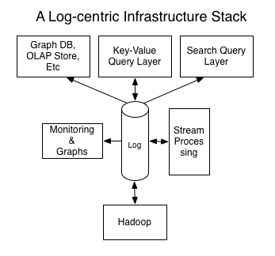

Parse.ly is log-centric, too
============================

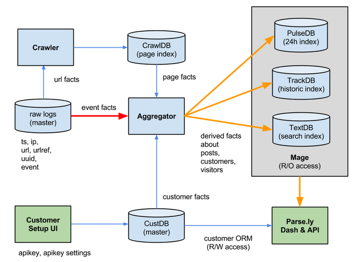

.. note::
    * Our databases are ultimately views to the raw logs
    * We use "logs" in more places than just that now
    * Used to "fan out" data to consuming services
    * Makes adding new services trivial

Introducing Apache Kafka
========================

Log centric message passing system developed at LinkedIn.

Designed for throughput and extremely efficient resource use.

    * Persists to disk, but in-memory serving of recent data
    * Little to no overhead for addition consumers
    * Scalable to tens of thousands of messages per second

As of 0.8, full replication of topic data.

.. note::
    * Halfway between pub/sub and message passing
    * Caches everything in memory it can, only going to disk
      when necessary.
    * Our Stats:

      * 3 m1.medium instances w/1TB EBS
      * 1 core / 2.75G memory
      * 6k in / 16k out
      * 75mbps in / 180mbps out

Kafka concepts
==============

=============== ==================================================================
Concept         Description
=============== ==================================================================
Cluster         An arrangement of Brokers & Zookeeper nodes
Broker          An individual node in the Cluster
Topic           A group of related messages (a stream)
Partition       Part of a topic, used for replication
Producer        Publishes messages to stream
Consumer Group  Group of related processes reading a topic
Offset          Point in a topic that the consumer has read to
=============== ==================================================================

.. note::
    * Consumer groups balance partitions to read among themselves
    * Offsets make it like non-ephemeral pub-sub

What's the catch?
=================

Replication isn't perfect. Network partitions can cause problems.

No out of order acknowldegement

    * "Offset" is a marker of where the consumer is in a log, nothing more
    * On a restart, you know where to start reading, but not if individual
      messages before the stored offset were fully processed.
    * In practice, this isn't as much of a problem as it sounds.

.. note::
    * Not as much of a problem if you batch and update offset once batch
      is done
    * Just takes some occasionally clever ways of handling messages

Kafka is a "distributed log"
============================

Topics are **logs**, not queues.

Consumers **read into offsets of the log**.

Logs are **maintained for a configurable period of time**.

Messages can be **"replayed"**.

Consumers can **share identical logs easily**.

.. note::
    * Consumers **do not "eat" messages**.
    * Prior to 0.8, "offsets" were literal byte offsets into the log

Multi-consumer
==============

Even if Kafka's availability and scalability story isn't interesting to you,
the **multi-consumer story should be**.

.. image:: ./_static/multiconsumer.png
    :width: 60%
    :align: center

.. note::
    * Since we only store the offset for a consumer group,
      the overhead for new consumer groups is nil

Queue problems, revisited
=========================

Traditional queues (e.g. RabbitMQ / Redis):

* not distributed / highly available at core
* not persistent ("overflows" easily)
* more consumers mean more queue server load

**Kafka solves all of these problems.**

.. note::
    * out of order acks are actually expensive

        * random disk seek/writes aren't cheap!
    * more consumers = duplicated messages

Kafka + Storm
=============

Good fit for at-least-once processing

Great fit for Trident's batching

    * No need to out of order acks in either case

Able to keep up with Storm's high-throughput processing

Great for handling backpressure during traffic spikes

.. note::
    * Be sure to explain Trident and/or at-least-once
    * Handles backpressure by providing buffers between major
      processing steps
    * Doing news analytics, the traffic is bursty. Strategic messaging
      use gives us insurance against huge events taking down our systems

Kafka in Python (1)
===================

python-kafka (0.8+)
    * https://github.com/mumrah/kafka-python

.. sourcecode:: python

    from kafka.client import KafkaClient
    from kafka.consumer import SimpleConsumer

    kafka = KafkaClient('localhost:9092')
    consumer = SimpleConsumer(kafka, 'test_consumer', 'raw_data')
    start = time.time()
    for msg in consumer:
        count += 1
        if count % 1000 == 0:
            dur = time.time() - start
            print 'Reading at {:.2f} messages/sec'.format(dur/1000)
            start = time.time()

Kafka in Python (2)
===================

samsa (0.7x)
    * https://github.com/getsamsa/samsa

.. sourcecode:: python

    import time
    from kazoo.client import KazooClient
    from samsa.cluster import Cluster

    zk = KazooClient()
    zk.start()
    cluster = Cluster(zk)
    queue = cluster.topics['raw_data'].subscribe('test_consumer')
    start = time.time()
    for msg in queue:
        count += 1
        if count % 1000 == 0:
            dur = time.time() - start
            print 'Reading at {:.2f} messages/sec'.format(dur/1000)
            queue.commit_offsets() # commit to zk every 1k msgs

Other Log-Centric Companies
===========================

============= ========= ========
Company       Logs      Workers
============= ========= ========
LinkedIn      Kafka*    Samza
Twitter       Kafka     Storm*
Spotify       Kafka     Storm
Wikipedia     Kafka     Storm
Outbrain      Kafka     Storm
LivePerson    Kafka     Storm
Netflix       Kafka     ???
============= ========= ========

==========
Conclusion
==========

What we've learned
==================

* There is no **silver bullet** data processing technology.
* Log storage is very cheap, and getting cheaper.
* "Timestamped facts" is rawest form of data available.
* Storm and Kafka allow you to develop atop those facts.
* Organizing around real-time logs is a wise decision.

Questions?
==========

Go forth and stream!

Parse.ly:

* http://parse.ly
* http://twitter.com/parsely

Andrew & Keith:

* http://twitter.com/amontalenti
* http://twitter.com/kbourgoin

.. raw:: html

    

.. ifnotslides::

    .. raw:: html

        

.. ifslides::

    .. raw:: html

        
