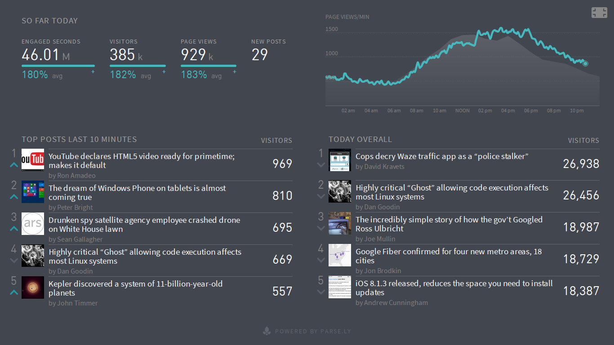

==============
Python ♥ Storm
==============

A Pythonista in Stormland.

by Andrew Montalenti, CTO

.. rst-class:: logo

    .. image:: ./_static/parsely.png
        :width: 40%
        :align: right

Agenda
======

* Parse.ly problem space
* Why Storm for Python?
* Why `streamparse`?
* Other frameworks
* Python on Storm examples

Admin
=====

Our presentations and code:

http://parse.ly/code

This presentation's slides:

http://parse.ly/slides/streamparse

This presentation's notes:

http://parse.ly/slides/streamparse

=================
What is Parse.ly?
=================

What is Parse.ly?
=================

Web content analytics for digital storytellers.

    .. image:: ./_static/banner_01.png
        :align: center
    .. image:: ./_static/banner_02.png
        :align: center
    .. image:: ./_static/banner_03.png
        :align: center
    .. image:: ./_static/banner_04.png
        :align: center

.. note::

    Gives web content teams a clear understanding about
    **what readers want** and how to deliver it to them
    in the most effective way.

    Answers questions for journalists and editors, like:

    * What stories are **most popular in the last 4 hours**?
    * Which **authors drive the most Facebook traffic**?
    * What is the relationship between **sharing and reading**?

    For product teams, our API enables **dynamic content
    recommendations** which can be implemented in minutes.

Velocity
========

Average post has **<48-hour shelf life**.

.. image:: ./_static/pulse.png
    :width: 60%
    :align: center

.. note::

    * many posts get **most traffic in first few hours**
    * major news events can cause **bursty traffic**

Volume
======

Top publishers write **1000's of posts per day**.

.. note::

    * huge **long tail of posts** get traffic forever
    * Parse.ly tracks **8 billion page views per month**
    * ... from **over 250 million monthly unique browsers**

Time series data
================

.. image:: ./_static/sparklines_stacked.png
    :align: center

Summary data
============

.. image:: ./_static/summary_viz.png
    :align: center

Ranked data
===========

.. image:: ./_static/comparative.png
    :align: center

Benchmark data
==============

.. image:: ./_static/benchmarked_viz.png
    :align: center

Information radiators
=====================

======================
Architecture evolution
======================

Parse.ly Architecture, 2012
===========================

.. image:: /_static/tech_stack.png
    :width: 90%
    :align: center

.. note::

    To add more features, we had to add more workers and queues!

    Got harder and harder to develop on "the entire stack".

    More code devoted to ops, rather than business logic.

It started to get messy
=======================

.. image:: ./_static/monitors.jpg
    :width: 90%
    :align: center

Parse.ly Data Sources
=====================

.. image:: ./_static/parsely_data_sources.png
    :width: 70%
    :align: center

Parse.ly Architecture, 2014
===========================

.. image:: ./_static/parsely_log_arch.png
    :width: 90%
    :align: center

Introducing Storm
=================

We read:

"Storm is a **distributed real-time computation system**."

"Great," we thought. "But, what about Python support?"

Hmm...

storm.py
========

.. image:: _static/streamparse_comp.png
    :align: center
    :width: 80%

Petrel (1)
==========

- First serious effort to make Storm Pythonic.
- Open source by AirSage around ~2012.
- No commits in last 10 months.
- Maintainer no longer using Storm.

Petrel Design
=============

- ...

Word Stream Spout (Storm)
=========================

.. sourcecode:: clojure

    {"word-spout" (python-spout-spec
          options
          "spouts.words.WordSpout"
          ["word"]
          )
    }

Word Stream Spout in Python
===========================

.. sourcecode:: python

    import itertools

    from streamparse.spout import Spout

    class WordSpout(Spout):

        def initialize(self, conf, ctx):
            self.words = itertools.cycle(['dog', 'cat',
                                          'zebra', 'elephant'])

        def next_tuple(self):
            word = next(self.words)
            self.emit([word])

Word Count Bolt (Storm)
=======================

.. sourcecode:: clojure

    {"count-bolt" (python-bolt-spec
            options
            {"word-spout" :shuffle}
            "bolts.wordcount.WordCount
             ["word" "count"]
             :p 2
           )
    }

Word Count Bolt in Python
=========================

.. sourcecode:: python

    from collections import Counter

    from streamparse.bolt import Bolt

    class WordCounter(Bolt):

        def initialize(self, conf, ctx):
            self.counts = Counter()

        def process(self, tup):
            word = tup.values[0]
            self.counts[word] += 1
            self.emit([word, self.counts[word]])
            self.log('%s: %d' % (word, self.counts[word]))

streamparse
===========

``sparse`` provides a CLI front-end to ``streamparse``, a framework for
creating Python projects for running, debugging, and submitting Storm
topologies for data processing.

After installing the ``lein`` (only dependency), you can run::

    pip install streamparse

This will offer a command-line tool, ``sparse``. Use::

    sparse quickstart

Running and debugging
=====================

You can then run the local Storm topology using::

    $ sparse run
    Running wordcount topology...
    Options: {:spec "topologies/wordcount.clj", ...}
    #<StormTopology StormTopology(spouts:{word-spout=...
    storm.daemon.nimbus - Starting Nimbus with conf {...
    storm.daemon.supervisor - Starting supervisor with id 4960ac74...
    storm.daemon.nimbus - Received topology submission with conf {...
    ... lots of output as topology runs...

======================
A New Parse.ly Backend
======================

Reference Architecture
======================

.. image:: ./_static/parsely_ref_arch.png
    :width: 90%
    :align: center

Complete F/OSS Stack
====================

.. image:: ./_static/parsely_oss.png
    :width: 90%
    :align: center

A vision for new metrics
========================

.. image:: _static/parsely_icons.png
    :width: 50%
    :align: center

More scale
==========

.. image:: _static/parsely_scale.png
    :width: 50%
    :align: center

======================
Organizing around logs
======================

Kafka and Multi-consumer
========================

Even if Kafka's availability and scalability story isn't interesting to you,
the **multi-consumer story should be**.

Unfortunately, `kafka-python` does not support multi-consumer properly. Our
team is working to fix this with our own more Pythonic Kafka binding that
implements the full protocol.

.. image:: ./_static/multiconsumer.png
    :width: 60%
    :align: center

Kafka + Storm
=============

Good fit for at-least-once processing.

No need for out-of-order acks.

Community work is ongoing for at-most-once processing.

Able to keep up with Storm's high-throughput processing.

Great for handling backpressure during traffic spikes.

Kafka in Python (1)
===================

python-kafka (0.8+)
    * https://github.com/mumrah/kafka-python

.. sourcecode:: python

    from kafka.client import KafkaClient
    from kafka.consumer import SimpleConsumer

    kafka = KafkaClient('localhost:9092')
    consumer = SimpleConsumer(kafka, 'test_consumer', 'raw_data')
    start = time.time()
    for msg in consumer:
        count += 1
        if count % 1000 == 0:
            dur = time.time() - start
            print 'Reading at {:.2f} messages/sec'.format(dur/1000)
            start = time.time()

Kafka in Python (2)
===================

samsa (0.7 support working, 0.8 support on branch)
project rename coming soon, too

    * https://github.com/getsamsa/samsa

.. sourcecode:: python

    import time
    from kazoo.client import KazooClient
    from samsa.cluster import Cluster

    zk = KazooClient()
    zk.start()
    cluster = Cluster(zk)
    queue = cluster.topics['raw_data'].subscribe('test_consumer')
    start = time.time()
    for msg in queue:
        count += 1
        if count % 1000 == 0:
            dur = time.time() - start
            print 'Reading at {:.2f} messages/sec'.format(dur/1000)
            queue.commit_offsets() # commit to zk every 1k msgs

Other Log-Centric Companies
===========================

============= ========= ========
Company       Logs      Workers
============= ========= ========
LinkedIn      Kafka*    Samza
Twitter       Kafka     Storm*
Pinterest     Kafka     Storm
Spotify       Kafka     Storm
Wikipedia     Kafka     Storm
Outbrain      Kafka     Storm
LivePerson    Kafka     Storm
Netflix       Kafka     ???
============= ========= ========

==========
Conclusion
==========

What we've learned
==================

* There is no **silver bullet** data processing technology.
* Log storage is very cheap, and getting cheaper.
* "Timestamped facts" is rawest form of data available.
* Storm and Kafka allow you to develop atop those facts.
* Organizing around real-time logs is a wise decision.

Questions?
==========

Go forth and stream!

Parse.ly:

* http://parse.ly/code
* http://twitter.com/parsely

Me:

* http://twitter.com/amontalenti

.. raw:: html

    

.. ifnotslides::

    .. raw:: html

        

.. ifslides::

    .. raw:: html

        
