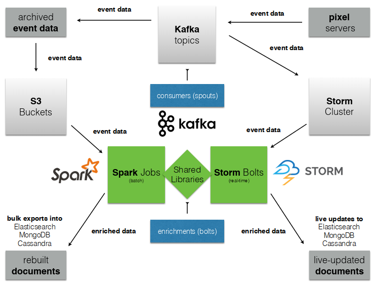

===========
streamparse
===========

*Defeat the Python GIL with Apache Storm.*

Andrew Montalenti, CTO

.. rst-class:: logo

    .. image:: ./_static/parsely.png
        :width: 40%
        :align: right

About Me
========

- CTO/co-founder of Parse.ly
- Hacking in Python for over a decade
- Fully distributed team

**@amontalenti** on Twitter:

http://twitter.com/amontalenti

Python GIL
==========

Python's GIL does not allow true multi-thread parallelism:

.. image:: _static/python_gil_new.png
    :align: center
    :width: 80%

And on multi-core, it even leads to lock contention:

.. image:: _static/python_gil.png
    :align: center
    :width: 80%

`@dabeaz`_ discussed this in a Friday talk on concurrency.

.. _@dabeaz: http://twitter.com/dabeaz

Queues and workers
==================

.. rst-class:: spaced

    .. image:: /_static/queues_and_workers.png
        :width: 70%
        :align: center

Standard way to solve GIL woes.

**Queues**: ZeroMQ => Redis => RabbitMQ

**Workers**: Cron Jobs => RQ => Celery

Parse.ly Architecture, 2012
===========================

.. image:: /_static/tech_stack.png
    :width: 90%
    :align: center

It started to get messy
=======================

.. image:: ./_static/monitors.jpg
    :width: 90%
    :align: center

As Hettinger Says...
====================

"There must be a better way..."

What is this Storm thing?
=========================

We read:

"Storm is a **distributed real-time computation system**."

Dramatically simplifies your workers and queues.

"Great," we thought. "But, what about Python support?"

That's what streamparse is about.

==================
Our Storm Use Case
==================

What is Parse.ly?
=================

Web content analytics for digital storytellers.

Some of our customers:

.. image:: ./_static/parsely_customers.png
    :width: 98%
    :align: center

Elegant data dashboards
=======================

Informing thousands of editors and writers every day:

.. image:: ./_static/glimpse.png
    :width: 98%
    :align: center

Powerful data APIs
==================

Powering billions of site visits every month:

.. image:: ./_static/newyorker_related.png
    :width: 98%
    :align: center

Too many datas!
===============

.. image:: ./_static/sparklines_multiple.png
    :width: 90%
    :align: center

"Python Can't Do This"
======================

"Free lunch is over."

"It can't scale."

"It's a toy language."

**"Shoulda used Scala."**

Python Can't Scale?
===================

Eat that, haters!

Thanks to Storm
===============

.. image:: ./_static/storm_applied.png
    :width: 90%
    :align: center

streamparse is Pythonic Storm
=============================

.. image:: ./_static/streamparse_logo.png

streamparse lets you parse real-time streams of data.

It smoothly integrates Python code with Apache Storm.

Easy quickstart, good CLI/tooling, production tested.

Good for: Analytics, Logs, Sensors, Low-Latency Stuff.

Agenda
======

* Storm topology concepts
* Storm internals
* How does Python work with Storm?
* streamparse overview
* pykafka preview

Slides on Twitter; follow **@amontalenti**.

- Slides: http://parse.ly/slides/streamparse
- Notes: http://parse.ly/slides/streamparse/notes

=======================
Storm Topology Concepts
=======================

Storm Abstractions
==================

Storm provides abstractions for data processing:

- Tuple
- Spout
- Bolt
- Topology

Wired Topology
==============

.. rst-class:: spaced

    .. image:: ./_static/topology.png
        :width: 80%
        :align: center

WARNING
=======

Using Python pseudocode and coroutines!

Tuple
=====

A single data record that flows through your cluster.

.. sourcecode:: python

    # tuple spec: ["word"]
    word = ("dog",)
    # tuple spec: ["word", "count"]
    word_count = ("dog", 4)

Spout
=====

A component that emits raw data into cluster.

.. sourcecode:: python

    class Spout(object):
        def next_tuple():
            """Called repeatedly to emit tuples."""

    @coroutine
    def spout_coroutine(spout, target):
        """Get tuple from spout and send it to target."""
        while True:
            tup = spout.next_tuple()
            if tup is None:
                time.sleep(10)
                continue
            if target is not None:
                target.send(tup)

Bolt
====

A component that implements one processing stage.

.. sourcecode:: python

    class Bolt(object):
        def process(tup):
            """Called repeatedly to process tuples."""

    @coroutine
    def bolt_coroutine(bolt, target):
        """Get tuple from input, process it in Bolt.
           Then send it to next bolt target, if it exists."""
        while True:
            tup = (yield)
            if tup is None:
                time.sleep(10)
                continue
            to_emit = bolt.process(tup)
            if target is not None:
                target.send(to_emit)

Topology
========

Directed Acyclic Graph (DAG) describing it all.

.. sourcecode:: python

    # lay out topology
    spout = WordSpout
    bolts = [WordCountBolt, DebugPrintBolt]

    # wire topology
    topology = wire(spout=spout, bolts=bolts)

    # start the topology
    next(topology)

===============
Storm Internals
===============

Tuple Tree
==========

.. rst-class:: spaced

    .. image:: ./_static/wordcount.png
        :width: 70%
        :align: center

Streams, Grouping and Parallelism
=================================

================ ================= =======================
X                word-spout        word-count-bolt
================ ================= =======================
input            None              word-spout
output           word-count-bolt   None
tuple            ``("dog",)``      ``("dog", 4)``
stream           ``["word"]``      ``["word", "count"]``
grouping         ``["word"]``      ``":shuffle"``
parallelism      2                 8
================ ================= =======================

Nimbus and Storm UI
===================

.. rst-class:: spaced

    .. image:: ./_static/storm_ui.png
        :width: 98%
        :align: center

Workers and Zookeeper
=====================

.. rst-class:: spaced

    .. image:: ./_static/storm_cluster.png
        :width: 80%
        :align: center

Empty Slots
===========

.. rst-class:: spaced

    .. image:: ./_static/storm_slots_empty.png
        :width: 90%
        :align: center

Filled Slots and Rebalancing
============================

.. rst-class:: spaced

    .. image:: ./_static/storm_slots_filled.png
        :width: 90%
        :align: center

BTW, Buy This Book!
===================

Source of these diagrams.

**Storm Applied**, by Manning Press.

Reviewed in `Storm, The Big Reference`_.

.. image:: ./_static/storm_applied.png
    :width: 50%
    :align: center

.. _Storm, The Big Reference: http://blog.parsely.com/post/1271/storm/

Network Transfer
================

.. rst-class:: spaced

    .. image:: ./_static/storm_transfer.png
        :width: 90%
        :align: center

So, Storm is Sorta Amazing!
===========================

Storm...

- will **guarantee processing** via tuple trees
- does **tuneable parallelism** per component
- implements a **high availability** model
- allocates **Python process slots** on physical nodes
- helps us **rebalance computation** across cluster
- handles **network messaging automatically**

And, it **beats the GIL**!

Let's Do This!
==============

=======================
Getting Python on Storm
=======================

Multi-Lang Protocol (1)
=======================

Storm supports Python through the **multi-lang protocol**.

- JSON protocol
- Works via shell-based components
- Communicate over ``STDIN`` and ``STDOUT``

Clean, UNIX-y.

Can use CPython, PyPy; no need for Jython or Py4J.

Kinda quirky, but also relatively simple to implement.

Multi-Lang Protocol (2)
=======================

Each component of a "Python" Storm topology is either:

- ``ShellSpout``
- ``ShellBolt``

Java implementations speak to Python via light JSON.

There's **one sub-process per Storm task**.

If ``p = 8``, then **8 Python processes** are spawned.

Multi-Lang Protocol (3)
=======================

.. sourcecode:: text

    INIT: JVM    => Python   >JSON
    XFER: JVM    => JVM      >Kryo
    DATA: JVM    => Python   >JSON
    EMIT: Python => JVM      >JSON
    XFER: JVM    => JVM      >Kryo
     ACK: Python => JVM      >JSON
    BEAT: JVM    => Python   >JSON
    SYNC: Python => JVM      >JSON

storm.py issues
===============

Storm bundles "storm.py" (a multi-lang implementation).

But, it's not Pythonic.

We'll fix that, we thought!

Storm as Infrastructure
=======================

Thought: Storm should be like Cassandra/Elasticsearch.

"Written in Java, but Pythonic nonetheless."

Need: Python as a **first-class citizen**.

Must also fix "Javanonic" bits (e.g. packaging).

====================
streamparse overview
====================

Enter streamparse
=================

Initial release Apr 2014; one year of active development.

600+ stars `on Github`_, was a trending repo in May 2014.

90+ mailing list members and 5 new committers.

3 Parse.ly engineers maintaining it.

Funding `from DARPA`_. (Yes, really!)

.. _"Real-Time Streams and Logs": https://www.youtube.com/watch?v=od8U-XijzlQ
.. _on Github: https://github.com/Parsely/streamparse
.. _from DARPA: http://www.fastcompany.com/3040363/the-future-of-search-brought-to-you-by-the-pentagon

streamparse CLI
===============

``sparse`` provides a CLI front-end to ``streamparse``, a framework for
creating Python projects for running, debugging, and submitting Storm
topologies for data processing.

After installing the ``lein`` (only dependency), you can run::

    pip install streamparse

This will offer a command-line tool, ``sparse``. Use::

    sparse quickstart

Running and debugging
=====================

You can then run the local Storm topology using::

    $ sparse run
    Running wordcount topology...
    Options: {:spec "topologies/wordcount.clj", ...}
    #<StormTopology StormTopology(spouts:{word-spout=...
    storm.daemon.nimbus - Starting Nimbus with conf {...
    storm.daemon.supervisor - Starting supervisor with id 4960ac74...
    storm.daemon.nimbus - Received topology submission with conf {...
    ... lots of output as topology runs...

See a `live demo on YouTube`_.

.. _live demo on YouTube: https://youtu.be/od8U-XijzlQ?t=14m19s

Submitting to remote cluster
============================

**Single command**::

    $ sparse submit

Does all the following **magic**:

    - Makes virtualenvs across cluster
    - Builds a JAR out of your source code
    - Opens reverse tunnel to Nimbus
    - Constructs an in-memory Topology spec
    - Uploads JAR to Nimbus

streamparse supplants storm.py
==============================

.. image:: _static/streamparse_comp.png
    :align: center
    :width: 80%

======================
Let's Make a Topology!
======================

Word Stream Spout (Storm DSL)
=============================

.. sourcecode:: clojure

    {"word-spout" (python-spout-spec options
          "spouts.words.WordSpout" ; class (spout)
          ["word"]                 ; stream (fields)
        )
    }

Word Stream Spout in Python
===========================

.. sourcecode:: python

    import itertools

    from streamparse.spout import Spout

    class Words(Spout):

        def initialize(self, conf, ctx):
            self.words = itertools.cycle(['dog', 'cat',
                                          'zebra', 'elephant'])

        def next_tuple(self):
            word = next(self.words)
            self.emit([word])

Emits one-word tuples from endless generator.

Word Count Bolt (Storm DSL)
===========================

.. sourcecode:: clojure

    {"word-count-bolt" (python-bolt-spec options
            {"word-spout" ["word"]}     ; input (grouping)
            "bolts.wordcount.WordCount" ; class (bolt)
            ["word" "count"]            ; stream (fields)
            :p 2                        ; parallelism
        )
    }

Word Count Bolt in Python
=========================

.. sourcecode:: python

    from collections import Counter

    from streamparse.bolt import Bolt

    class WordCount(Bolt):

        def initialize(self, conf, ctx):
            self.counts = Counter()

        def process(self, tup):
            word = tup.values[0]
            self.counts[word] += 1
            self.log('%s: %d' % (word, self.counts[word]))

Keeps word counts in-memory (assumes grouping).

BatchingBolt for Performance
============================

.. sourcecode:: python

    from streamparse.bolt import BatchingBolt

    class WordCount(BatchingBolt):

        secs_between_batches = 5

        def group_key(self, tup):
            # collect batches of words
            word = tup.values[0]
            return word

        def process_batch(self, key, tups):
            # emit the count of words we had per 5s batch
            self.emit([key, len(tups)])

Implements **5-second micro-batches**.

Bolts for Real-Time ETL
=======================

.. rst-class:: spaced

    .. image:: ./_static/storm_data.png
        :width: 80%
        :align: center

streamparse config.json
=======================

.. sourcecode:: javascript

    {
        "envs": {
            "0.8": {
                "user": "ubuntu",
                "nimbus": "storm-head.ec2-ubuntu.com",
                "workers": ["storm1.ec2-ubuntu.com",
                            "storm2.ec2-ubuntu.com"],
                "log_path": "/var/log/ubuntu/storm",
                "virtualenv_root": "/data/virtualenvs"
            },
            "vagrant": {
                "user": "ubuntu",
                "nimbus": "vagrant.local",
                "workers": ["vagrant.local"],
                "log_path": "/home/ubuntu/storm/logs",
                "virtualenv_root": "/home/ubuntu/virtualenvs"
            }
        }
    }

sparse options
==============

.. sourcecode:: text

    $ sparse help

    Usage:
            sparse quickstart <project_name>
            sparse run [-o <option>]... [-p <par>] [-t <time>] [-dv]
            sparse submit [-o <option>]... [-p <par>] [-e <env>] [-dvf]
            sparse list [-e <env>] [-v]
            sparse kill [-e <env>] [-v]
            sparse tail [-e <env>] [--pattern <regex>]
            sparse (-h | --help)
            sparse --version

===============
pykafka preview
===============

Apache Kafka
============

"Messaging rethought as a commit log."

Distributed ``tail -f``.

Perfect fit for Storm Spouts.

Able to keep up with Storm's high-throughput processing.

Great for handling backpressure during traffic spikes.

pykafka
=======

We have released ``pykafka``.

NOT to be confused with ``kafka-python``.

Upgraded internal Kafka 0.7 driver to 0.8.2:

- SimpleConsumer **and** BalancedConsumer
- Consumer Groups with Zookeeper
- Pure Python protocol implementation
- C protocol implementation in works (via librdkafka)

https://github.com/Parsely/pykafka

Questions?
==========

I'm sprinting on a Python Storm Topology DSL.

Hacking on Monday and Tuesday. Join me!

streamparse: http://github.com/Parsely/streamparse

Parse.ly's hiring: http://parse.ly/jobs

Find me on Twitter: http://twitter.com/amontalenti

That's it!

========
Appendix
========

Storm and Spark Together
========================

Overall Architecture
====================

Multi-Lang Impl's in Python
===========================

- `storm.py`_ (Storm, 2010)
- `Petrel`_ (AirSage, Dec 2012)
- `streamparse`_ (Parse.ly, Apr 2014)
- `pyleus`_ (Yelp, Oct 2014)

Plans to unify IPC implementations around **pystorm**.

.. _storm.py: https://github.com/apache/storm/blob/master/storm-core/src/multilang/py/storm.py
.. _Petrel: https://github.com/AirSage/Petrel
.. _pyleus: https://github.com/Yelp/pyleus
.. _streamparse: http://github.com/Parsely/streamparse

Other Related Projects
======================

- `lein`_ - Clojure dependency manager used by streamparse
- `flux`_ - YAML Topology runner
- `Clojure DSL`_ - Topology DSL, bundled with Storm
- `Trident`_ - Java "high-level" DSL, bundled with Storm

streamparse uses lein and a simplified Clojure DSL.

Will add a Python DSL in 2.x.

.. _lein: http://leiningen.org/
.. _flux: https://github.com/ptgoetz/flux
.. _Clojure DSL: http://storm.apache.org/documentation/Clojure-DSL.html
.. _Trident: https://storm.apache.org/documentation/Trident-tutorial.html
.. _marceline: https://github.com/yieldbot/marceline
.. _@Parsely: http://twitter.com/Parsely
.. _@amontalenti: http://twitter.com/amontalenti

Topology Wiring
===============

.. sourcecode:: python

    def wire(spout, bolts=[]):
        """Wire the components together in a pipeline.
        Return the spout coroutine that kicks it off."""
        last, target = None, None
        for bolt in reversed(bolts):
            step = bolt_coroutine(bolt)
            if last is None:
                last = step
                continue
            else:
                step = bolt_coroutine(bolt, target=last)
                last = step
        return spout_coroutine(spout, target=last)

Streams, Grouping, Parallelism
==============================

(still pseudocode)

.. sourcecode:: python

    class WordCount(Topology):
        spouts = [
            WordSpout(
                name="word-spout",
                out=["word"],
                p=2)
        ]
        bolts = [
            WordCountBolt(
                name="word-count-bolt",
                from=WordSpout,
                group_on="word",
                out=["word", "count"],
                p=8)
        ]

Storm is "Javanonic"
====================

Ironic term one of my engineers came up with for a project that feels very
Java-like, and not very "Pythonic".

Storm Java Quirks
=================

- Topology Java builder API (eek).
- Projects built with Maven tasks (yuck).
- Deployment needs a JAR of your code (ugh).
- No simple local dev workflow built-in (boo).
- Storm uses Thrift interfaces (shrug).

Multi-Lang Protocol
===================

The multi-lang protocol has the full core:

- ack
- fail
- emit
- anchor
- log
- heartbeat
- tuple tree

Kafka and Multi-consumer
========================

.. image:: ./_static/multiconsumer.png
    :width: 60%
    :align: center

Kafka Consumer Groups
=====================

.. image:: ./_static/consumer_groups.png
    :width: 60%
    :align: center

streamparse projects
====================

.. image:: ./_static/streamparse_project.png
    :width: 90%
    :align: center

.. raw:: html

    

.. ifnotslides::

    .. raw:: html

        

.. ifslides::

    .. raw:: html

        
