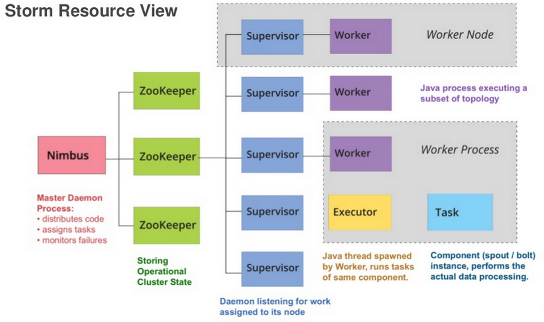
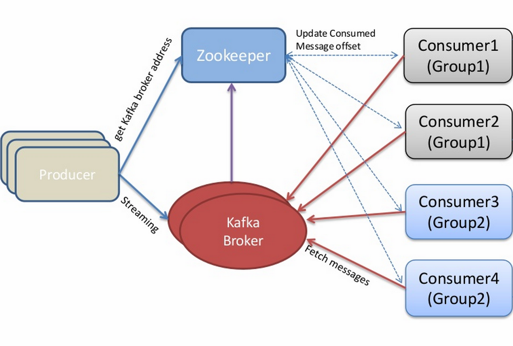
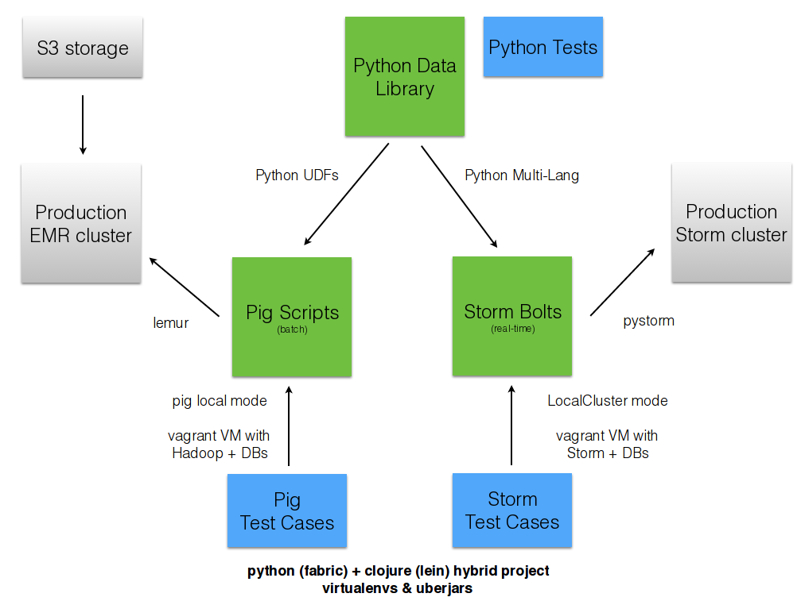

========================
Real-time Streams & Logs 
========================

Andrew Montalenti, CTO

Keith Bourgoin, Backend Lead

.. rst-class:: logo

    .. image:: ./_static/parsely.png
        :width: 40%
        :align: right

Agenda
======

* Parse.ly problem space
* Architecture evolution
* Aggregating the stream (Storm)
* Organizing around logs (Kafka)

=================
What is Parse.ly?
=================

What is Parse.ly?
=================

Web content analytics for digital storytellers.

    .. image:: ./_static/banner_01.png
        :align: center
    .. image:: ./_static/banner_02.png
        :align: center
    .. image:: ./_static/banner_03.png
        :align: center
    .. image:: ./_static/banner_04.png
        :align: center

Core Value
==========

Gives web content teams a clear understanding about 
**what readers want** and how to deliver it to them 
in the most effective way.

Answers questions for journalists and editors, like:

* What stories are **most popular in the last 4 hours**?
* Which **authors drive the most Facebook traffic**?
* What is the relationship between **sharing and reading**?

For product teams, our API enables **dynamic content
recommendations** which can be implemented in minutes.

Variety of Data
===============

Audience data:
    * visitors
    * sessions

Engagement data:
    * page views
    * time spent
    * social shares

Content data:
    * headline
    * keywords / topics
    * author / section / tag

Velocity
========

* average post has **<48-hour shelf life**
* many posts get **most traffic in first few hours**
* major news events can cause **bursty traffic**

.. image:: ./_static/pulse.png
    :width: 60%
    :align: center

Volume
======

* top publishers write **1000's of posts per day**
* huge **long tail of posts** get traffic forever
* Parse.ly tracks **8 billion page views per month**
* ... from **over 250 million monthly unique browsers**

Time series data
================

.. image:: ./_static/sparklines_multiple.png
    :align: center

.. image:: ./_static/sparklines_stacked.png
    :align: center

Summary data
============

.. image:: ./_static/summary_viz.png
    :align: center

Ranked data
===========

.. image:: ./_static/comparative.png
    :align: center

Benchmark data
==============

.. image:: ./_static/benchmarked_viz.png
    :align: center

Information radiators
=====================

.. image:: ./_static/glimpse.png
    :width: 100%
    :align: center

======================
Architecture evolution
======================

Stack Overview
==============

.. image:: ./_static/oss_logos.png
    :width: 90%
    :align: center

Queues and workers
==================

.. image:: /_static/queues_and_workers.png
    :width: 90%
    :align: center

**Queues**: RabbitMQ => Redis => ZeroMQ

**Workers**: Cron Jobs => Celery

Queue problems
==============

Traditional queues (e.g. RabbitMQ / Redis):

* not distributed / highly available at core
* not persistent ("overflows" easily)
* more consumers mean more queue server load

(Hint: ZeroMQ trades these problems for another: unreliability.)

Lots of moving parts
====================

.. image:: /_static/tech_stack.png
    :width: 90%
    :align: center

To add more features...
=======================

... we had to add more workers and queues!

Got harder and harder to develop on "the entire stack".

More code devoted to ops, rather than business logic.

Workers and databases
=====================

Different workers-and-queues would talk to different databases.

Worker problems
===============

* no control for parallelism and load distribution
* no guaranteed processing for multi-stage pipelines
* no fault tolerance for individual stages
* difficult to do local / beta / staging environments
* dependencies between worker stages are unclear

In short: it started to get messy
=================================

Introducing Storm
=================

Storm is a **distributed real-time computation system**.

Hadoop provides a set of general primitives for doing batch processing.

Storm provides a set of **general primitives** for doing **real-time computation**.

Hadoop primitives
=================

**Durable** Data Set, typically from **S3**.

**HDFS** used for inter-process communication.

**Mappers** & **Reducers**; Pig's **JobFlow** is a **DAG**.

**JobTracker** & **TaskTracker** manage execution.

**Tuneable parallelism** + built-in **fault tolerance**.

Storm primitives
================

**Streaming** Data Set, typically from **Kafka**.

**ZeroMQ** used for inter-process communication.

**Bolts** & **Spouts**; Storm's **Topology** is a **DAG**.

**Nimbus** & **Workers** manage execution.

**Tuneable parallelism** + built-in **fault tolerance**.

Storm features
==============

=============== ====================================================================
Feature         Description
=============== ====================================================================
Speed           1,000,000 tuples per second per node, using Kyro and ZeroMQ
Fault Tolerance Workers and Storm management daemons self-heal in face of failure
Parallelism     Tasks run on cluster w/ tuneable parallelism
Guaranteed Msgs Tracks lineage of data tuples, providing an at-least-once guarantee
Easy Code Mgmt  Several versions of code in a cluster; multiple languages supported
Local Dev       Entire system can run in "local mode" for end-to-end testing
=============== ====================================================================

Storm core concepts
===================

=============== =======================================================================
Concept         Description
=============== =======================================================================
Stream          Unbounded sequence of data tuples with named fields
Spout           A source of a Stream of tuples; typically reading from Kafka
Bolt            Computation steps that consume Streams and emits new Streams
Grouping        Way of partitioning data fed to a Bolt; for example: by field, shuffle
Topology        Directed Acyclic Graph (DAG) describing Spouts, Bolts, & Groupings
=============== =======================================================================

Wired Topology
==============

.. image:: ./_static/topology.png
    :width: 80%
    :align: center

Storm cluster concepts
======================

=============== =======================================================================
Concept         Description
=============== =======================================================================
Tasks           The process/thread corresponding to a running Bolt/Spout in a cluster
Workers         The JVM process managing work for a given physical node in the cluster
Supervisor      The process monitoring the Worker processes on a single machine
Nimbus          Coordinates work among Workers/Supervisors; maintains cluster stats
=============== =======================================================================

Running Cluster
===============

Tuple Tree
==========

Tuple tree, anchoring, and retries.

Twitter Click Spout (Storm)
===========================

.. sourcecode:: clojure

    {"twitter-click-spout"
        (shell-spout-spec
            ;; Python Spout implementation:
            ;; - fetches tweets (e.g. from Kafka)
            ;; - emits (urlref, url, ts) tuples
            ["python" "spouts_twitter_click.py"]
            ;; Stream declaration:
            ["urlref" "url" "ts"]
        )
    }

Mock Spout in Python
====================

.. sourcecode:: python

    import storm
    import time

    class TwitterClickSpout(storm.Spout):

        def nextTuple(self):
            urlref = "http://t.co/1234"
            url = "http://theatlantic.com/1234"
            ts = "2014-03-10T08:00:000Z"
            storm.emit([urlref, url, ts])
            time.sleep(0.1)

    TwitterClickSpout().run()

Twitter Count Bolt (Storm)
==========================

.. sourcecode:: clojure

    {"twitter-count-bolt"
        (shell-bolt-spec
            ;; Bolt input: Spout and field grouping on urlref
            {"twitter-click-spout" ["urlref"]}
            ;; Python Bolt implementation:
            ;; - maintains a Counter of urlref
            ;; - increments as new clicks arrive
            ["python" "bolts_twitter_count.py"]
            ;; Emits latest click count for each tweet as new Stream
            ["twitter_link" "clicks"]
            :p 4
        )
    }

Mock Bolt in Python
===================

.. sourcecode:: python

    import storm

    from collections import Counter

    class TwitterCountBolt(storm.BasicBolt):

        def initialize(self, conf, context):
            self.counter = Counter()

        def process(self, tup):
            urlref, url, ts = tup.values
            self.counter[urlref] += 1
            # new count emitted to stream upon increment
            storm.emit([urlref, self.counter[urlref]]) 

    TwitterCountBolt().run() 
 
Running a local cluster
=======================

.. sourcecode:: clojure

    (defn run-local! []
        (let [cluster (LocalCluster.)]
            ;; submit the topology configured above
            (.submitTopology cluster 
                            ;; topology name
                            "test-topology" 
                            ;; topology settings
                            {TOPOLOGY-DEBUG true} 
                            ;; topology configuration
                            (mk-topology))
            ;; sleep for 5 seconds before...
            (Thread/sleep 5000)
            ;; shutting down the cluster
            (.shutdown cluster)
        ) 
    )

======================
Organizing around logs
======================

LinkedIn's lattice problem
==========================

Enter the unified log
=====================

Log-centric is simpler
======================

Parse.ly is log-centric, too
============================

.. image:: ./_static/parsely_log_arch.png
    :width: 80%
    :align: center

Introducing Kafka
=================

=============== ==================================================================
Feature         Description
=============== ==================================================================
Speed           100's of megabytes of reads/writes per sec from 1000's of clients
Durability      Can use your entire disk to create a massive message backlog
Scalability     Cluster-oriented design allows for horizontal machine scaling
Availability    Cluster-oriented design allows for node failures without data loss (in 0.8+)
Multi-consumer  Many clients can read the same stream with no penalty
=============== ==================================================================

Kafka concepts
==============

=============== ==================================================================
Concept         Description
=============== ==================================================================
Topic           A group of related messages (a stream)
Producer        Procs that publish msgs to stream
Consumer        Procs that subscribe to msgs from stream
Broker          An individual node in the Cluster
Cluster         An arrangement of Brokers & Zookeeper nodes
Offset          Coordinated state between Consumers and Brokers (in Zookeeper)
=============== ==================================================================

Kafka layout
============

Kafka is a "distributed log"
============================

Topics are **logs**, not queues.

Consumers **read into offsets of the log**.

Consumers **do not "eat" messages**.

Logs are **maintained for a configurable period of time**.

Messages can be **"replayed"**.

Consumers can **share identical logs easily**.

Multi-consumer
==============

Even if Kafka's availability and scalability story isn't interesting to you,
the **multi-consumer story should be**.

Queue problems, revisited
=========================

Traditional queues (e.g. RabbitMQ / Redis):

* not distributed / highly available at core
* not persistent ("overflows" easily)
* more consumers mean more queue server load

**Kafka solves all of these problems.**

Kafka in Python (1)
===================

.. sourcecode:: python

    import logging

    # generic Zookeeper library
    from kazoo.client import KazooClient

    # Parse.ly's open source Kafka client library
    from samsa.cluster import Cluster

    log = logging.getLogger('test_capture_pageviews')

    def _connect_kafka():
        zk = KazooClient()
        zk.start()
        cluster = Cluster(zk)
        queue = cluster\
                    .topics['pixel_data']\
                    .subscribe('test_capture_pageviews')
        return queue

Kafka in Python (2)
===================

.. sourcecode:: python

    def pageview_stream():
        queue = _connect_kafka()
        count = 0
        for msg in queue:
            count += 1
            if count % 1000 == 0:
                # in this example, offsets are committed to 
                # Zookeeper every 1000 messages
                queue.commit_offsets()
            urlref, url, ts = parse_msg(msg)
            yield urlref, url, ts

Python + Clojure
================

Opportunity for **Python & Clojure** to work together.

**Python**: core computations & DB persistence.

**fabric**: deployment & remote server management.

**Clojure**: interop with JVM infrastructure: Storm & Hadoop.

**lein**: manage Java's classpath & packaging nightmare.

Interested in Clojure? I have another talk, `Clojonic`_, that can
teach you a little Clojure from a Python perspective!

.. _Clojonic: http://pixelmonkey.org/pub/clojonic

Python and JVM interop
======================

Other Log-Centric Companies
===========================

    ============= ========= ========
    Company       Logs      Workers
    ============= ========= ========
    LinkedIn      Kafka*    Samza
    Twitter       Kafka     Storm*
    Spotify       Kafka     Storm
    Wikipedia     Kafka     Storm
    Outbrain      Kafka     Storm
    LivePerson    Kafka     Storm
    Netflix       Kafka     ???
    ============= ========= ========

Alternative Approaches
======================

    ============= ========= ==========
    Company       Logs      Workers
    ============= ========= ==========
    Yahoo         S4        S4
    Amazon        Kinesis   ???
    Google        ???       Millwheel*
    Facebook      Scribe*   ???
    UC Berkeley   RDDs*     Spark*
    ============= ========= ==========

==========
Conclusion
==========

What we've learned
==================

.. rst-class:: build

    * There is no **silver bullet** database technology.
    * Especially for data problems with "the three V's".
    * Log storage is very cheap, and getting cheaper.
    * "Timestamped facts" is rawest form of data available.
    * Organizing around logs is a wise decision.

What we're learning
===================

.. rst-class:: build

    * Maybe databases aren't databases, but are just **indexes**.
    * Database isn't endpoint for data, but a **transformation**.
    * Duplicating data across databases isn't evil...
    * ... especially for query flexibility and latency ...
    * ... but only if **master data set makes rebuilds easy**!

What is becoming clear
======================

.. rst-class:: build

    * There is a gap between Batch and Real-Time processing.
    * But, it may not be there for long.
    * Lots of active research going into making gap narrower.
    * Pig + Storm work today, and offer powerful abstractions.
    * Log-centric design (Kafka) will prep you for tomorrow.

Questions?
==========

Go forth and stream!

Parse.ly:

* http://parse.ly
* http://twitter.com/parsely

Andrew & Keith:

* http://twitter.com/amontalenti
* http://twitter.com/kbourgoin

.. raw:: html

    

.. ifnotslides::

    .. raw:: html

        

.. ifslides::

    .. raw:: html

        

